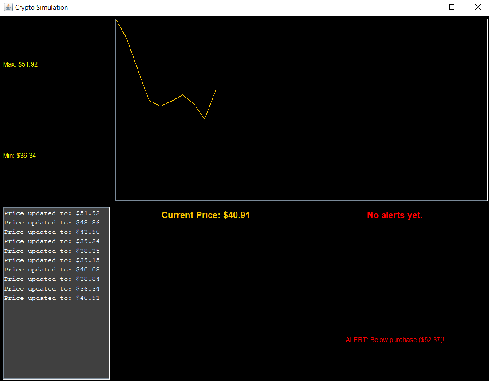
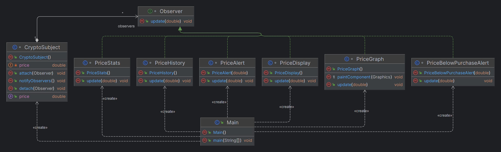

# CryptoPriceObserver
A project for monitoring cryptocurrency price fluctuations using the Observer design pattern. Implements a flexible and extensible architecture to track and notify changes in real-time.

## Application Interface
### Main View
Below is the main interface of the application:

## Observer Design Pattern Diagram
The diagram below illustrates the implementation of the **Observer Design Pattern** used in the application:

## Features

The application provides the following functionalities:

- **Cryptocurrency Price Monitoring:** Track prices of multiple cryptocurrencies in real-time.
- **Current Price Display:** View the latest price for your selected cryptocurrencies.
- **Price Alerts:** Set alarms for price thresholds that are exceeded or fall below a specific value.
- **Detailed Price History:** Access a comprehensive history of price fluctuations.
- **Real-Time Graph:** Visualize the evolution of prices with a live updating chart.

- ## Purpose of the Application

This application is created solely to demonstrate the **Observer Design Pattern** through a practical use case. It showcases how the pattern can be implemented to monitor and respond to real-time cryptocurrency price fluctuations in a concrete scenario.

